# Overview

게시판 서비스.

## 1. 서비스 구성

각 서비스 구성요소는 다음과 같다.

|서비스|사용 기술|목적 및 기능|비고|
|---|---|---|---|
|Admin|Node 16.15.0 npm 8.5.5 React 18.1.0|관리자 페이지 (백오피스)||
|Web|Node 16.15.0 npm 8.5.5 React 18.1.0|커뮤니티 웹페이지||
|API Gateway|Node 16.15.1 npm 8.11.0 Express 4.16.1|OAuth2 인증 회원 정보 인증 및 JWT 발급 및 인증 각 요청에 대해 해당 API로 프록시||
|API|Node 16.15.1 npm 8.11.0 Express 4.16.1|API Gateway에서 인증을 마친 후 넘어온 요청을 처리하는 서비스. 
|Filtering|Go 1.18|신규 게시물 중 부적절한 컨텐츠를 담은 내용을 감지하는 서비스||
|Notifications|Go 1.18|각 회원이 작성한 댓글 및 리액션 등에 대해 알림을 제공하는 서비스||
|Chatting|Java 18|채팅 서비스||

## 2. 각 서비스 간 통신 프로토콜
기본적인 프로토콜은 전부 HTTP REST 기반으로 개발.

## 3. 데이터베이스 및 메시징 서비스 등 활용 정보

|이름|목적|비고|
|---|---|---|
|Redis|API Gateway 서비스와 연결되었으며, JWT 토큰 저장 및 인증정보 보관|
|PostgreSQL|API 및 채팅 API와 연결된 데이터베이스|
|Apache Kafka|신규 댓글 및 리액션, 게시물 등 발생시 관련 정보를 필터링 서비스로 넘겨주기 위한 데이터 스트리밍 서비스|

